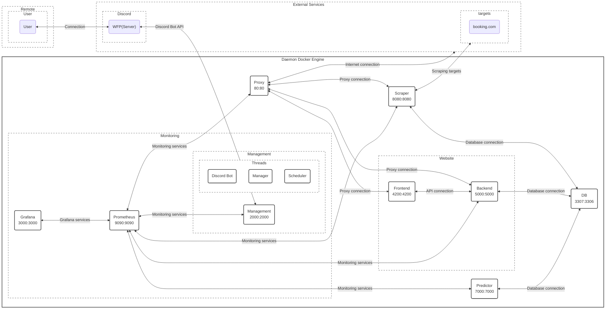

Web Scraper Project
===

## Introduction

This project is a set of interconnected services that collectively form a data acquisition and processing system. Each service has its own specific responsibilities, runs independently in a separate Docker container, and communicates with other services as needed.

## Service Overview and Architecture

Here's a brief description of what each service does:

1. Management: Starts, stops -> controls & has the Discord Bot running
2. Scraper: Scrapes booking.com with the parameter received from the RESTful POST
3. Frontend Service: Handles user interactions. It displays the data, allows users to initiate a scraping operation, and download the dataset as an Excel table. It also triggers the prediction algorithm and displays the resulting graphs.
4. Backend: Handles requests like the download of the excel containing the scraped data
5. Predictor: Executes the prediction algorithm on the dataset stored in the database.
6. Database: Stores all the scraped data and is accessed by other services when they need to read or write data.
7. Proxy: Forwards requests based on the route 
8. Prometheus: Collects metrics
9. Grafana: Better visualization of metrics collected

##  Mermaid diagram of the system architecture:


## Prerequisites

- Docker Desktop
  - all other necessaries are downloaded


## Installation

1. Clone the repository:
```git clone https://github.com/...```

2. Navigate to the directory:
3. Build and run the Docker services:


### change directory
...\webScraper>

```
docker build -t my-base-image:latest -f myapp/deploy/debian.base.Dockerfile .
docker build -t management:latest -f myapp/deploy/1-service.Dockerfile .
docker build -t scraper:latest -f myapp/deploy/2-service.Dockerfile .
docker build -t frontend:latest -f myapp/deploy/3-service.Dockerfile .
docker build -t backend:latest -f myapp/deploy/4-service.Dockerfile .
docker build -t predictor:latest -f myapp/deploy/5-service.Dockerfile .
```

### change directory
...\webScraper\myapp> docker compose up
...\webScraper\myapp> docker compose down
    if to be deleted

# terminal to database

inside docker:
```mysql -u root -p```

